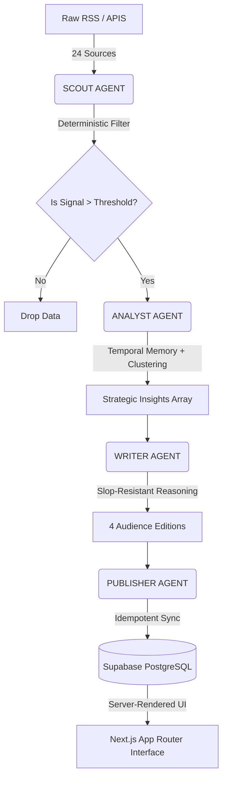

# 🚀 AI News Intelligence System (Serverless E2E Architecture)

A production-grade, multi-agent AI pipeline that autonomously scouts, filters, analyzes, and publishes high-signal AI news without human intervention. The system is engineered to solve the "AI Signal-to-Noise" problem. 

Rather than relying on massive, expensive, and inconsistent zero-shot LLM queries, this system implements a rigid **Separation of Concerns**. It utilizes a pure-Python deterministic filtering layer to drop 90% of noise, executing LLM inference *only* on the absolute highest-quality remaining data.

---

## 🏛️ System Architecture

---

## 🧠 The Agent Swarm

The pipeline is split into 4 autonomous agents running universally via a stateless GitHub Actions Cron Job synchronized to US Pacific Time (End-of-Day).

### 1. Detective Agent (Scout)
The Gatekeeper. Entirely deterministic, written in pure Python. Before a single API token is burned, Scout executes an **11-Stage Sequential Filter**:
1. **Multi-Vector Ingestion**: Scrapes 24 distinct global RSS feeds and 2 News APIs.
2. **HTML Sanitization**: Cleanses raw telemetry and malformed `<tags>`.
3. **Credibility Blacklist**: Hard-drops state-controlled media and known hallucination domains.
4. **URL Pattern Recognition**: Rejects marketing parameters, `/tutorials/`, and support `/docs/`.
5. **Domain Tiering Multipliers**: Applies mathematical weighting (Tier 1 = OpenAI/Deepmind Labs, Tier 2 = TechCrunch/Android Authority).
6. **AI Context Matrix**: Scans syntax for 18 explicitly defined AI vectors (`LLM`, `transformer`, `fine-tuning`).
7. **Zero-Context Reject**: Automatically purges articles with 0 absolute AI density, bypassing Tier-1 source immunity.
8. **Anti-Noise Subtraction**: Docks points for consumer hardware fluff (`laptop review`, `gaming news`).
9. **Minimum Threshold Enforcement**: Drops all articles scoring below the `MIN_OUTPUT` signal threshold.
10. **Transatlantic Temporal Normalization**: Forces execution tracking explicitly to US Pacific Time (`UTC-8`) mapped against an expanded `36-hour` rolling buffer. This permanently solves the "International Timezone Gap" where EU/Asia automated servers miss Silicon Valley EOD news drops.
11. **Native Deduplication**: Implements `difflib.SequenceMatcher` to kill duplicate narrative stories from aggregator publishers before they reach the LLM.

### 2. Strategic Agent (Analyst)
The Reasoning Core. Powered by Gemini-2.5 on low temperature.
* **Temporal Intelligence**: The system stores local JSON state from the previous day's run. Analyst injects this memory into its prompt matrix, calculating the delta delta between "yesterday's baseline" and "today's influx" to identify Emerging Trends vs Decaying Hype mathematically.
* **Theme Clustering**: Aggregates the 4-6 surviving high-signal headlines into cohesive parent structures rather than scattered bullets.

### 3. Editorial Agent (Writer)
The Transformation Service.
* **Audience Splitting**: Generates 4 highly specific editions simultaneously: `Devs`, `Business`, `Students`, and `General`.
* **The Anti-Slop Directive**: Instructed via prompt injection to forcefully reject common AI phrasing (banned words: *leverage, delve, unlock, digital landscape*). It utilizes premium journalistic constraints, rendering semantic `
` and array strings directly.

### 4. Distribution Agent (Publisher)
The Backend Archivist.
* **Idempotency Locks**: Checks Supabase REST endpoints prior to writing cache to prevent database overwrites.
* **Simulated Atomicity**: Because we rely on REST rather than complex stored PostgreSQL procedures, Publisher simulates atomic transactions. If a child `article` payload fails to sync via the wire, Python automatically triggers a UUID cascade `DELETE` on the parent `newsletter` block, preventing orphaned UI state.

---

## 📡 The 24 Tracked Global Datastreams
The engine monitors the following Tier-1 and Tier-2 sources exactly:

* **Foundational Labs**: OpenAI, Anthropic (News & Eng), Google Deepmind, Google AI Blog, Mistral, Cohere, Meta AI, Stability.
* **Compute Infrastructure**: NVIDIA Newsroom, NVIDIA Developer.
* **Tech Journalism & Analysis**: TechCrunch, The Verge, Wired, Ars Technica, MIT Technology Review.
* **Indian & Asian Tech Media**: Economic Times Tech, Moneycontrol Tech, India Today Tech.
* **Emerging / Open Source**: Hugging Face Blog, r/MachineLearning, Simon Willison, Interconnects, AI For Newsroom, The AI Edge.
* **Consumer Tech Vectors**: Android Authority, Android Police, Smol AI News.

---

## 🧱 Deployment Stack
* **Automation Automation Framework**: Configured entirely on serverless GitHub Actions (`.github/workflows`). The Action commits the `insights.json` file back to the repository base daily so the Analyst Agent retains temporal memory across ephemeral Docker runs.
* **Interface**: Next.js 15 (App Router) with Tailwind CSS. Includes Route Intercepts, Deep-Linking UI Anchors, and an "Isolated Reader Mode" for intense deep-dives.
* **Database**: Supabase (PostgreSQL)
* **Intelligence Logic**: Python 3.12
